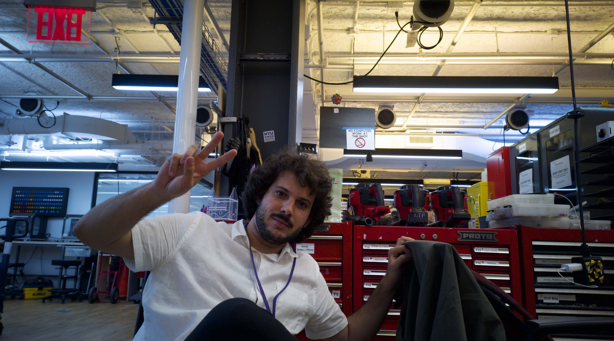

# ITP Camp Camera Project



## Demo

```
python camera.py
```

Enables taking photos by pressing the button attached to pin 10.

To see the images, host a simple HTTP server with

```
python -m http.server -d camimages
```

then navigate to `http://raspberrypi.local:8000`.
